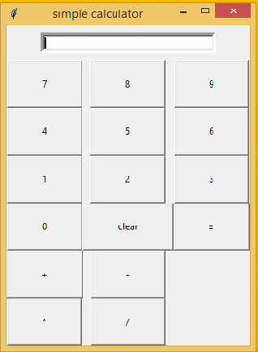

#calculator
introduction:
in this project,we made a simple calculator by importing all the elements from tkinter library.The calculator can perform arithematic operations like addition, subtraction, multiplication, & division between two numbers.
screenshot of simple calculator

functionalities
this calculator can perform operations like:
addition
subtraction
multiplication
division
